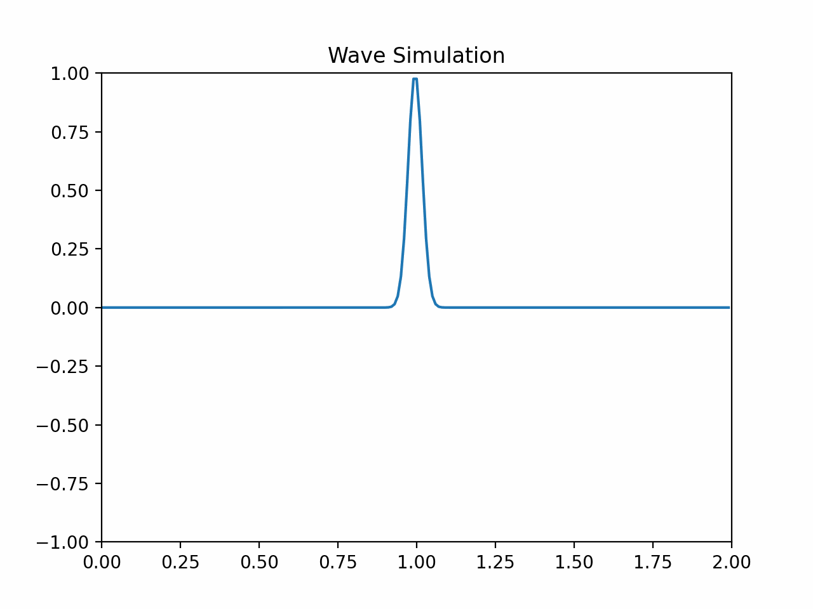

# physim.gpu


## Installation
TODO 

## Example

1. 1D Wave Simulation




# Understanding the 1D Wave Simulation (as explained by GPT-4o)

## 1. The Wave Equation in One Dimension

The 1D wave equation describes how waves, such as sound waves or waves on a string, propagate over time. It is given by:

$$\[
\frac{\partial^2 u}{\partial t^2} = c^2 \frac{\partial^2 u}{\partial x^2}
\]$$


Where:
- $\( u(x, t) \)$ is a function representing the wave's displacement at position $\( x \)$ and time $\( t \)$.
- $\( \frac{\partial^2 u}{\partial t^2} \)$ is the second derivative of $\( u \)$ with respect to time, representing how the wave's acceleration changes over time.
- $\( \frac{\partial^2 u}{\partial x^2} \)$ is the second derivative of $\( u \)$ with respect to space, representing how the curvature of the wave changes along the $\( x \)$-axis.
- $\( c \)$ is the wave speed, a constant that determines how fast the wave propagates through the medium.

## 2. Understanding the Derivatives

Before we jump into solving this, let’s briefly recall what these derivatives mean:

- **First Derivative** ($\( \frac{\partial u}{\partial t} \)$): Represents the rate of change of the wave's displacement over time, essentially the velocity of the wave at a given point.
- **Second Derivative** ($\( \frac{\partial^2 u}{\partial t^2} \)$): Represents how the velocity itself changes over time, i.e., the acceleration of the wave.

Similarly, for space:

- **First Spatial Derivative** ($\( \frac{\partial u}{\partial x} \)$): Represents the slope or gradient of the wave, indicating how steep the wave is at a given point.
- **Second Spatial Derivative** ($\( \frac{\partial^2 u}{\partial x^2} \)$): Represents the curvature of the wave. A positive value means the wave is curving upwards, and a negative value means it's curving downwards.

## 3. Discretizing the Wave Equation

To solve the wave equation numerically, we approximate these continuous derivatives using finite differences. This involves discretizing both time and space.

### Discretizing Space

We divide the spatial domain into small intervals of size $\( \Delta x \)$ (or `dx` in the code). If the total length of the domain is \( L \), we have \( N = \frac{L}{\Delta x} \) points in space, represented as \( x_0, x_1, \ldots, x_N \).

- For any point $\( i \)$, the position \( x_i \) is given by \( x_i = i \cdot \Delta x \).

### Discretizing Time

Similarly, time is divided into small steps of size \( \Delta t \) (or `dt`). For a given time step \( n \), the time is \( t_n = n \cdot \Delta t \).

- The value of \( u \) at position \( x_i \) and time \( t_n \) is represented as \( u_i^n \).

### Finite Difference Approximation

We approximate the derivatives in the wave equation using finite differences:

- **Second Derivative in Time**:

$$\[
\frac{\partial^2 u}{\partial t^2} \approx \frac{u_i^{n+1} - 2u_i^n + u_i^{n-1}}{\Delta t^2}
\]$$

- **Second Derivative in Space**:

$$\[
\frac{\partial^2 u}{\partial x^2} \approx \frac{u_{i+1}^n - 2u_i^n + u_{i-1}^n}{\Delta x^2}
\]$$

## 4. Numerical Solution

Substituting these finite differences into the wave equation gives us:

$$\[
\frac{u_i^{n+1} - 2u_i^n + u_i^{n-1}}{\Delta t^2} = c^2 \frac{u_{i+1}^n - 2u_i^n + u_{i-1}^n}{\Delta x^2}
\]$$

Rearranging to solve for \( u_i^{n+1} \) (the value of \( u \) at the next time step):

$$\[
u_i^{n+1} = 2u_i^n - u_i^{n-1} + \frac{c^2 \Delta t^2}{\Delta x^2} (u_{i+1}^n - 2u_i^n + u_{i-1}^n)
\]$$

In the code, this is represented as:

```python
u_xx = (jnp.roll(u, -1) - 2 * u + jnp.roll(u, 1)) / dx**2  # Second spatial derivative
u_next = 2 * u - u_prev + c**2 * dt**2 * u_xx  # Update rule for the wave
```

- `u_xx` calculates the second spatial derivative using the values of u at neighboring points.
- `u_next` computes the new value of u at each position using the previous and current values of u and the computed second derivative.


## 5. Stability Condition (Courant-Friedrichs-Lewy Condition)

For this numerical scheme to work correctly (not produce unrealistic results), the time step \( \Delta t \) must be small enough relative to \( \Delta x \) and the wave speed \( c \). This is given by the **Courant condition**:

$$\[
\Delta t \leq \frac{\Delta x}{c}
\]$$

In your code, you set the time step as:

```python
self.dt = dx / wave_speed
```

This ensures that your simulation remains stable.


## 6. Summary
1. **Wave Equation**: Describes how waves move in 1D.
2. **Discretization**: We break down space and time into small steps to approximate the derivatives using differences.
3. **Finite Difference**: A method to approximate derivatives by looking at neighboring points.
4. **Numerical Solution**: We use the finite difference method to step forward in time, calculating the wave's position at each new time step.
5. **Stability**: We need to choose time steps carefully to ensure the simulation behaves correctly.

